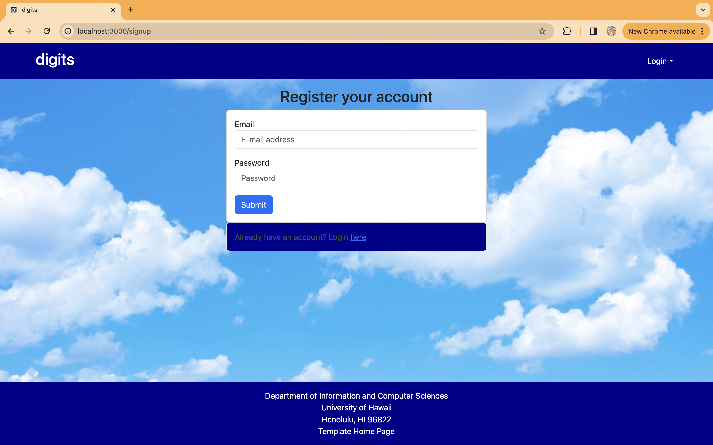
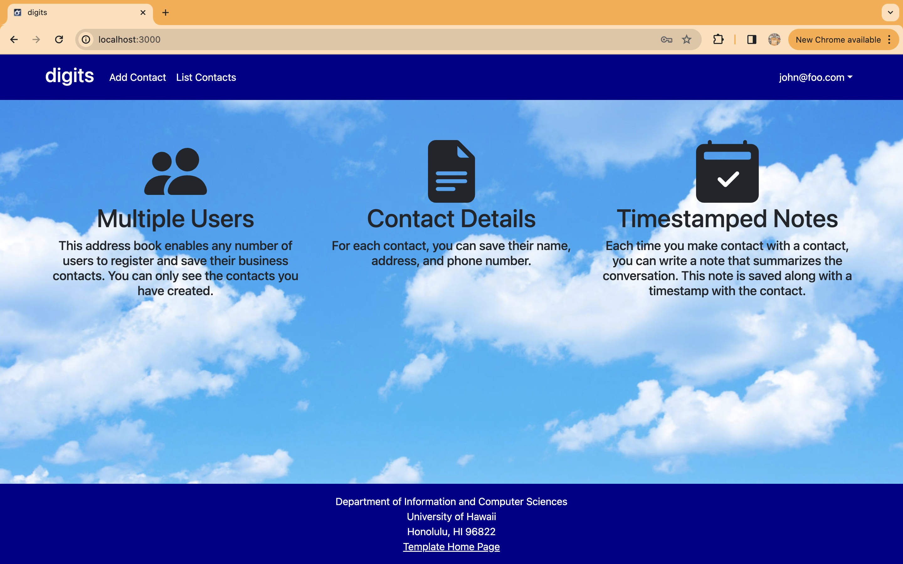
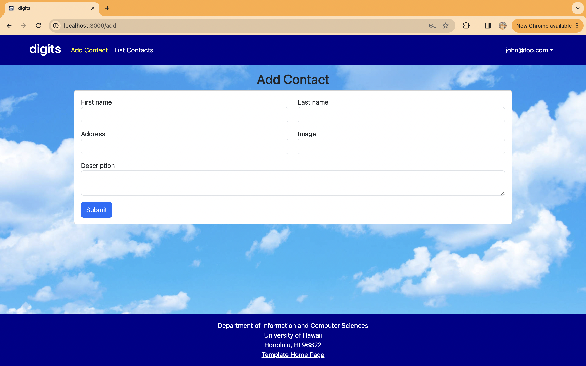
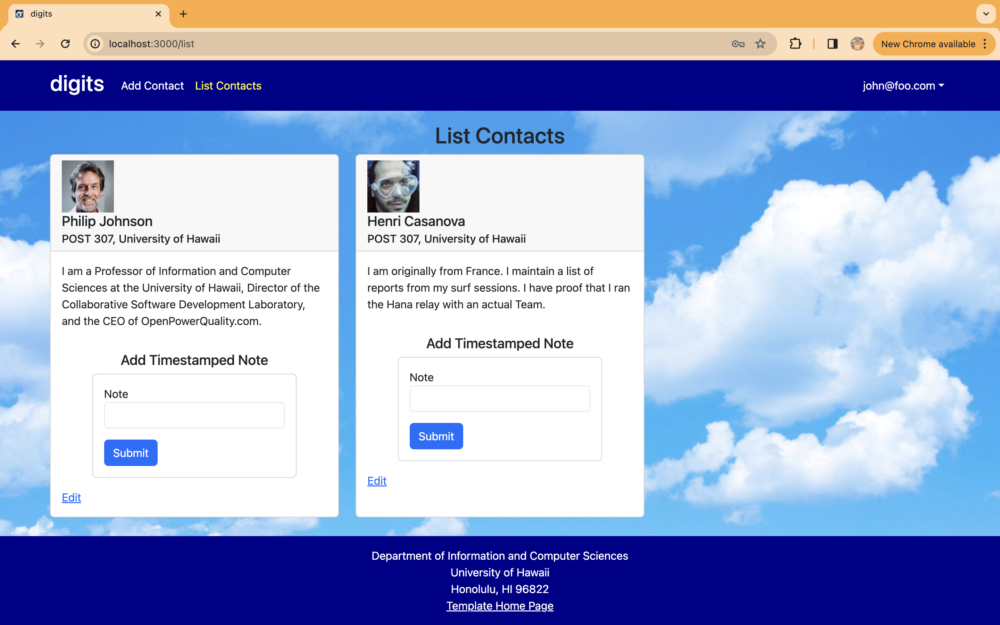
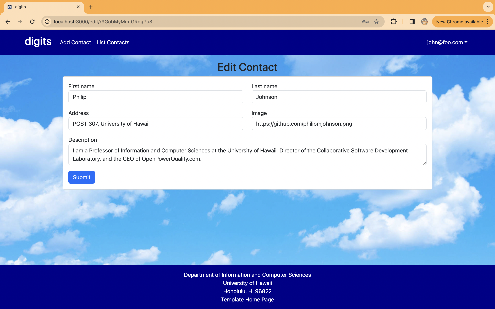
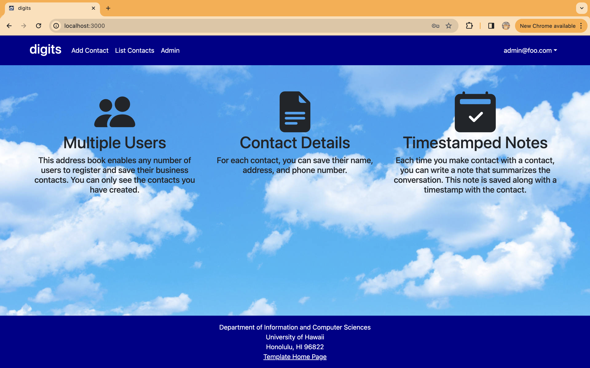
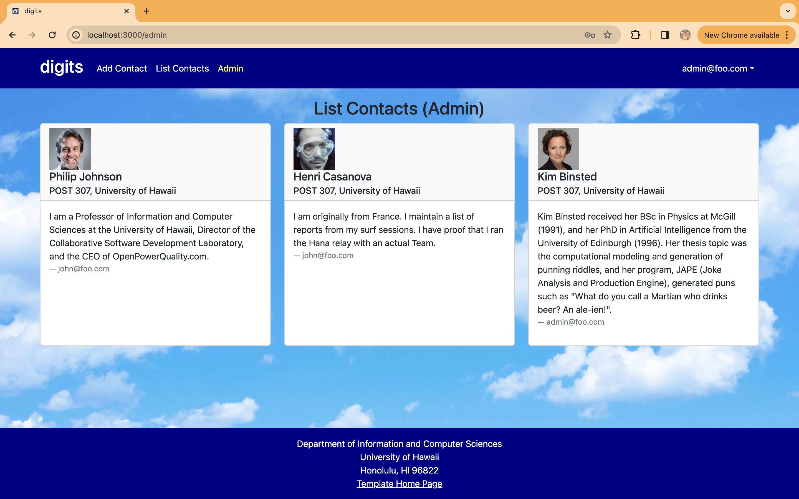
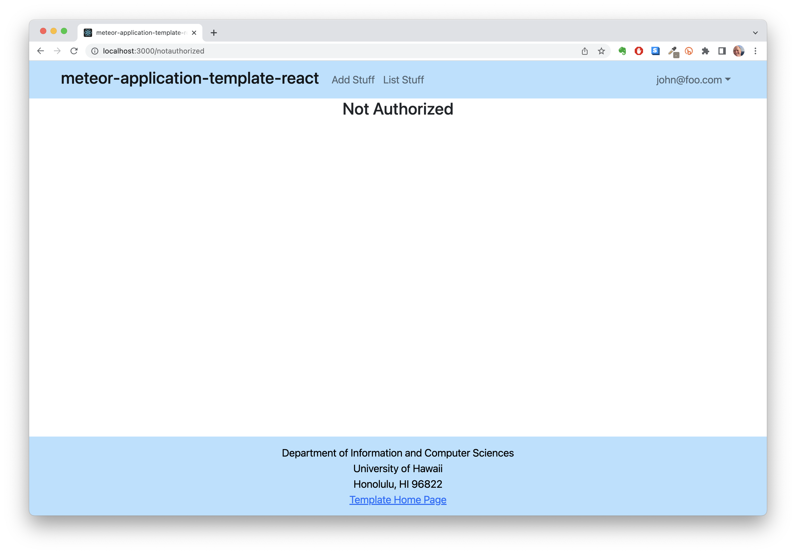

Digits is an application that allows users to:

* Register an account.
* Create and manage a set of contacts.
* Add a set of timestamped notes regarding their interactions with each contact.

## Installation

First, [install Meteor](https://www.meteor.com/install).

Second, go to [download a copy of Digits](https://github.com/blakewatanabe/digits).

Third, cd into the app/ directory of your local copy of the repo, and install third party libraries with:

```
$ meteor npm install
```

## Running the system

Once the libraries are installed, you can run the application by invoking the "start" script.

```
$ meteor npm run start
```

The first time you run the app, it will create some default users and data. Here is the output:

```
 meteor npm run start 

> meteor-application-template-react@ start /Users/carletonmoore/GitHub/ICS314/meteor-application-template-react/app
> meteor --no-release-check --exclude-archs web.browser.legacy,web.cordova --settings ../config/settings.development.json

[[[[[ ~/Documents/GitHub/digits/app ]]]]]  

=> Started proxy.                             
=> Started HMR server.                        
=> Started MongoDB.                           
I20240403-15:07:07.591(-10)? Creating the default user(s)
I20240403-15:07:07.622(-10)?   Creating user admin@foo.com.
I20240403-15:07:10.059(-10)?   Creating user john@foo.com.
I20240403-15:07:10.438(-10)? Creating default contacts.
I20240403-15:07:10.438(-10)?   Adding: Johnson (john@foo.com)
I20240403-15:07:10.595(-10)?   Adding: Casanova (john@foo.com)
I20240403-15:07:10.598(-10)?   Adding: Binsted (admin@foo.com)
=> Started your app.


=> App running at: http://localhost:3000/
```

### Viewing the running app

If all goes well, the template application will appear at [http://localhost:3000](http://localhost:3000).  You can login using the credentials in [settings.development.json](https://github.com/blakewatanabe/digits/blob/main/config/settings.development.json), or else register a new account.

### ESLint

You can verify that the code obeys our coding standards by running ESLint over the code in the imports/ directory with:

```
meteor npm run lint
```

## Walkthrough

The following sections describe the major features of this template.

#### Landing page

When you retrieve the app at http://localhost:3000, this is what should be displayed:


The next step is to use the Login menu to either Login to an existing account or register a new account.

#### Login page

Clicking on the Login link, then on the Sign In menu item displays this page:


#### Register page

Alternatively, clicking on the Login link, then on the Sign Up menu item displays this page:




#### Landing (after Login) page, non-Admin user

Once you log in (either to an existing account or by creating a new one), the navbar changes as follows:



You can now add new Stuff documents, and list the Stuff you have created. Note you cannot see any Stuff created by other users.

#### Add Contact page

After logging in, here is the page that allows you to add new Contact:



#### List Contact page

After logging in, here is the page that allows you to list all the Contact you have created:



You click the "Edit" link to go to the Edit Contact page, shown next.

#### Edit Contact page

After clicking on the "Edit" link associated with an item, this page displays that allows you to change and save it:



#### Landing (after Login), Admin user

You can define an "admin" user in the settings.json file. This user, after logging in, gets a special entry in the navbar:



#### Admin page (list all users contact)

To provide a simple example of a "super power" for Admin users, the Admin page lists all of the Contacts by all of the users:



Note that non-admin users cannot get to this page, even if they type in the URL by hand.



### Quality Assurance

#### ESLint

The application includes a [.eslintrc](https://github.com/ics-software-engineering/meteor-application-template-react/blob/main/app/.eslintrc) file to define the coding style adhered to in this application. You can invoke ESLint from the command line as follows:

```
[~/meteor-application-template-react/app]-> meteor npm run lint

> meteor-application-template-react@ lint /Users/philipjohnson/meteor-application-template-react/app
> eslint --quiet ./imports
```

ESLint should run without generating any errors.
